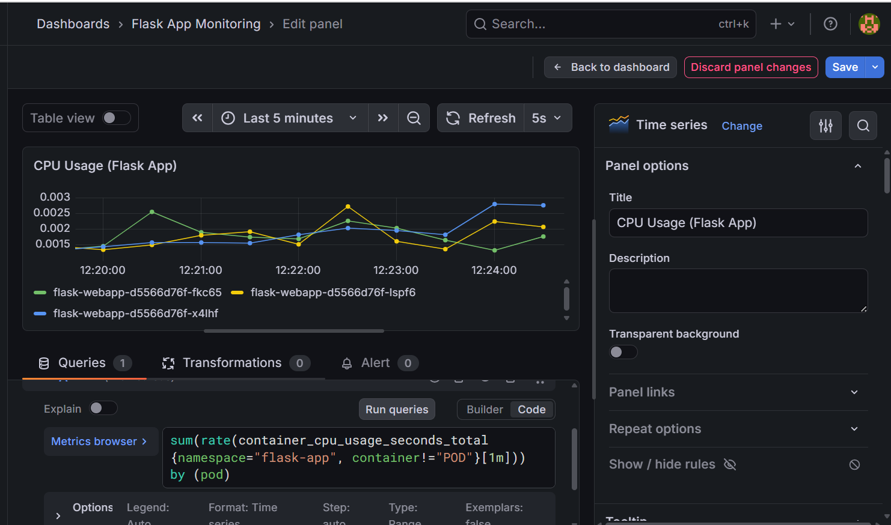
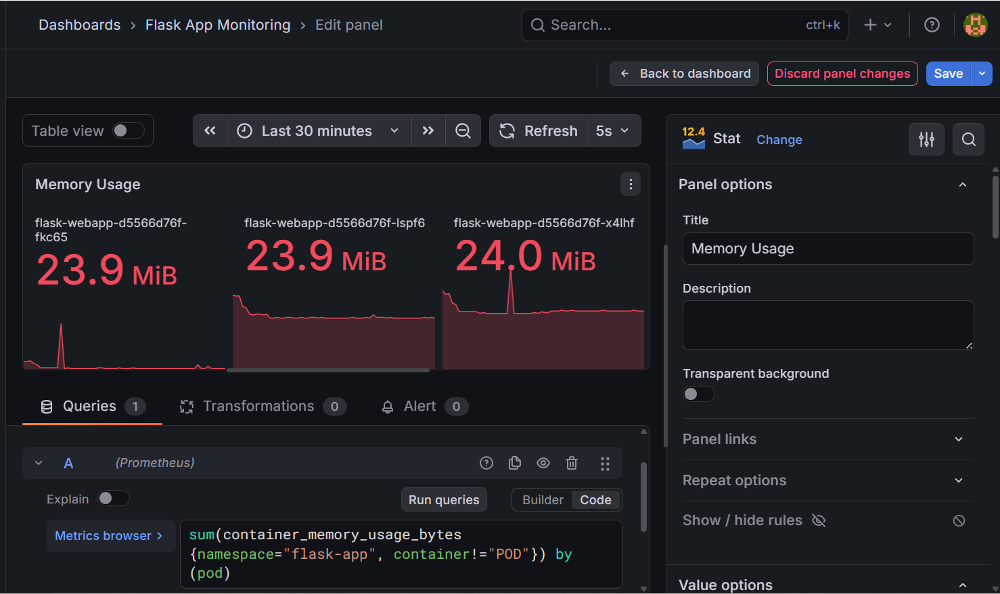
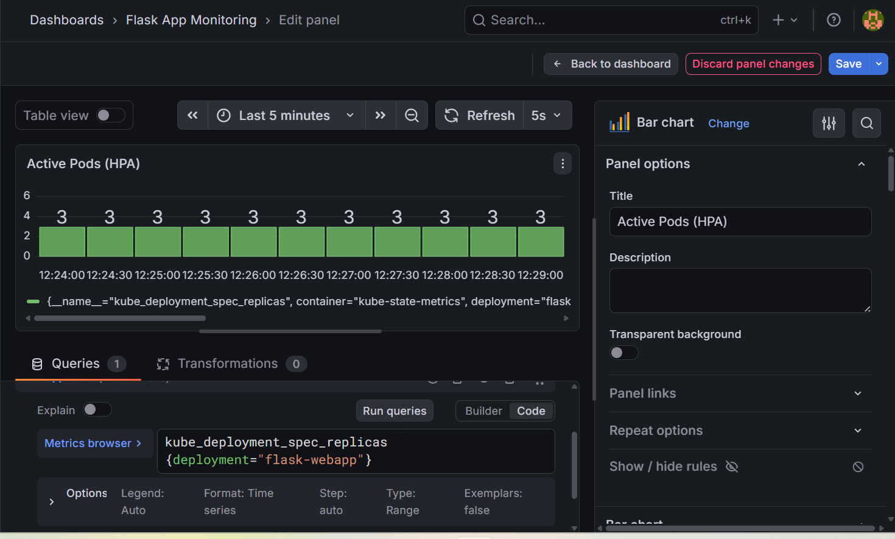

# 🚀 AWS + Kubernetes Auto Scaling Flask App

## 📌 Overview
A production-style DevOps project demonstrating how to deploy, scale, and monitor a Flask application using AWS, Terraform, Docker, and Kubernetes.

---

## 🏗️ Architecture

GitHub Push

↓

GitHub Actions (CI/CD)

↓

Docker Hub (versioned image)

↓

AWS EKS (Kubernetes cluster)

↓

Helm (manages deployment)

↓

LoadBalancer → Live App

### ☁️ AWS (Terraform)
- Application Load Balancer (ALB)
- EC2 instances (Dockerized Flask app)
- Auto Scaling Group (ASG)
- CloudWatch (Metrics & Alarms)
- SNS (Email Alerts)

### ☸️ Kubernetes
User → Service → Deployment → Pods → HPA (Auto Scaling)

---

## ⚙️ Key Features

### AWS
- High availability with ALB
- Auto Scaling based on CPU usage
- Self-healing EC2 instances
- Monitoring with CloudWatch
- Email alerts via SNS

### Kubernetes
- Containerized Flask app deployment
- Horizontal Pod Autoscaler (HPA)
- CPU-based scaling (1 → 3 pods)
- Self-healing pods
- Load testing using curl

---

## 🧪 Testing & Scaling

### AWS
- Simulated failure by stopping container
- Instance marked unhealthy
- Auto Scaling replaced instance automatically

### Kubernetes Load Test
```bash
while true; do curl http://127.0.0.1:<port>; done
- CPU usage increased
- HPA scaled pods automatically
- Scaled down after load reduced

---

📊 Observability
AWS
- CloudWatch CPU metrics
- Alarm triggers
- Auto Scaling activity tracking

Kubernetes

kubectl get pods -w
kubectl get hpa
- Real-time pod scaling
- CPU-based autoscaling behavior

---

## 🛠️ Tech Stack

| Tool | Purpose |
|------|---------|
| Flask | Web application |
| Docker | Containerization |
| Kubernetes (EKS) | Container orchestration |
| Helm | Kubernetes package manager |
| GitHub Actions | CI/CD automation |
| Terraform | Infrastructure as Code |
| AWS (EC2, ALB, ASG, EKS) | Cloud infrastructure |
| Prometheus + Grafana | Monitoring & alerting |

---

## 📁 Project Structure
aws-flask-auto-scaling/
├── app.py                    # Flask application
├── Dockerfile                # Container definition
├── requirements.txt
├── flask-app/                # Helm chart
│   ├── Chart.yaml
│   ├── values.yaml           # Single source of truth
│   └── templates/
│       ├── deployment.yaml
│       ├── service.yaml
│       └── hpa.yaml
├── k8s/                      # Raw Kubernetes manifests
├── terraform/                # AWS infrastructure
└── .github/workflows/
└── k8s-deploy.yml        # CI/CD pipeline

---

## 🚀 How to Deploy

### Prerequisites
- AWS CLI configured
- kubectl, eksctl, helm installed

### 1. Create EKS Cluster
```bash
eksctl create cluster \
  --name flask-cluster \
  --region ap-south-1 \
  --node-type t3.medium \
  --nodes 2
```

### 2. Deploy with Helm
```bash
helm upgrade --install flask-app ./flask-app \
  --set image.tag=latest
```

### 3. Get Live URL
```bash
kubectl get svc
```
---

## 🐛 Real Bugs I Debugged

- **504 Gateway Timeout** — fixed ALB health check path mismatch
- **ImagePullBackOff** — fixed Docker Hub image naming
- **HPA stuck at 0%** — fixed missing CPU requests in deployment
- **Helm template errors** — fixed targetPort case sensitivity

---
## 🎯 What This Demonstrates

- End-to-end DevOps workflow from code to production
- Difference between AWS ASG (infra scaling) vs Kubernetes HPA (workload scaling)
- Production deployment practices (versioned images, rolling updates, Helm)
- Real-world debugging and problem solving

---

## 📸 Screenshots (Scaling & Monitoring in Action)

These screenshots demonstrate real system behavior including auto scaling, monitoring, and load testing.

---

## ☁️ AWS

### CPU Utilization Spike


### CloudWatch Alarm Triggered


### Auto Scaling Activity


---

## ☸️ Kubernetes (Scaling)

### HPA scaling (CPU spike)


### Pods scaling (1 → 2)


### Load testing output


---

## 📊 Monitoring (Prometheus + Grafana)

### CPU Usage per Pod


### Memory Usage per Pod


### HPA / Pod Scaling Visualization


---

## 🧠 Key Learnings

* Auto Scaling (AWS vs Kubernetes)
* Infrastructure as Code using Terraform
* Importance of CPU requests in HPA
* Monitoring & alerting systems
* Building self-healing systems

## 💡 Highlights

* Built full DevOps pipeline (Terraform → Docker → Kubernetes)
* Achieved automatic scaling under load
* Implemented real-world monitoring and failure recovery

---

## 🎯 What This Project Demonstrates

- End-to-end DevOps workflow (Infra → App → Scaling → Monitoring)
- Difference between infrastructure scaling (AWS ASG) and workload scaling (Kubernetes HPA)
- Real-world debugging (502/504 errors, port mismatch, health checks)
- Observability using industry-standard tools (Prometheus + Grafana)

---
