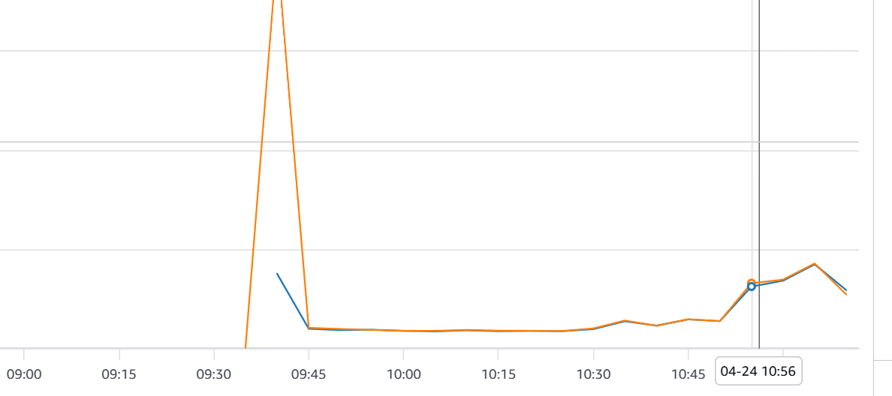
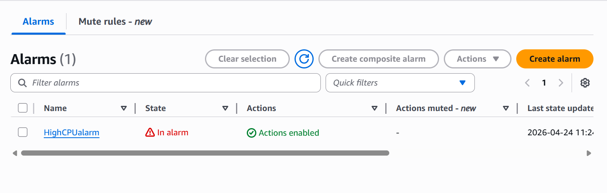
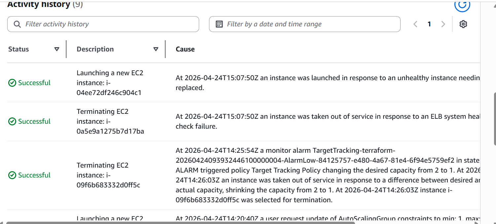
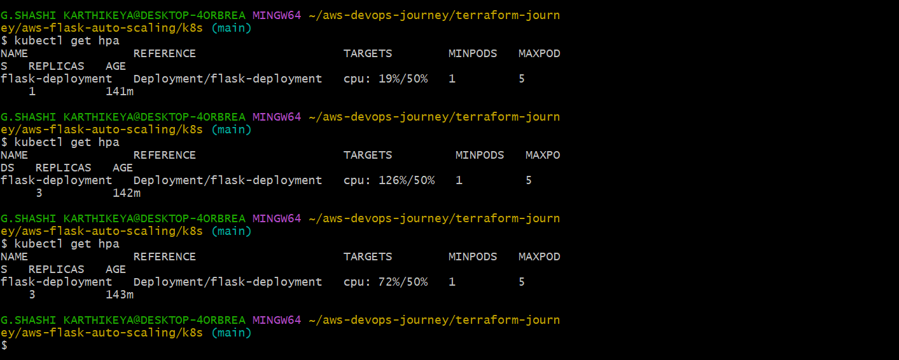
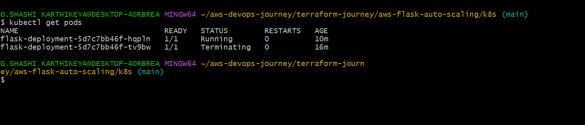
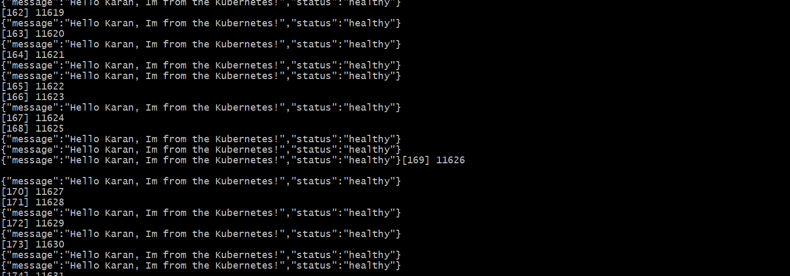

# 🚀 AWS + Kubernetes Auto Scaling Flask App

## 📌 Overview
A production-style DevOps project demonstrating how to deploy, scale, and monitor a Flask application using AWS, Terraform, Docker, and Kubernetes.

---

## 🏗️ Architecture

### ☁️ AWS (Terraform)
- Application Load Balancer (ALB)
- EC2 instances (Dockerized Flask app)
- Auto Scaling Group (ASG)
- CloudWatch (Metrics & Alarms)
- SNS (Email Alerts)

### ☸️ Kubernetes
User → Service → Deployment → Pods → HPA (Auto Scaling)

---

## ⚙️ Key Features

### AWS
- High availability with ALB
- Auto Scaling based on CPU usage
- Self-healing EC2 instances
- Monitoring with CloudWatch
- Email alerts via SNS

### Kubernetes
- Containerized Flask app deployment
- Horizontal Pod Autoscaler (HPA)
- CPU-based scaling (1 → 3 pods)
- Self-healing pods
- Load testing using curl

---

## 🧪 Testing & Scaling

### AWS
- Simulated failure by stopping container
- Instance marked unhealthy
- Auto Scaling replaced instance automatically

### Kubernetes Load Test
```bash
while true; do curl http://127.0.0.1:<port>; done
- CPU usage increased
- HPA scaled pods automatically
- Scaled down after load reduced

---

📊 Observability
AWS
- CloudWatch CPU metrics
- Alarm triggers
- Auto Scaling activity tracking

Kubernetes

kubectl get pods -w
kubectl get hpa
- Real-time pod scaling
- CPU-based autoscaling behavior

---

🛠️ Tech Stack
- AWS (EC2, ALB, ASG, CloudWatch, SNS)
- Terraform
- Docker
- Kubernetes (Minikube)
- Flask

---

🚀 Deployment

Terraform (AWS)
cd terraform
terraform init
terraform apply

Kubernetes

kubectl apply -f k8s/
kubectl autoscale deployment flask-deployment --cpu-percent=50 --min=1 --max=5
```
---

## 📸 Screenshots

These screenshots demonstrate real system behavior including auto scaling, monitoring, and load testing.

## AWS

### CPU Utilization Spike


### CloudWatch Alarm Triggered


### Auto Scaling Activity


## Kubernetes (Scaling)

### HPA scaling (CPU spike)


### Pods scaling (1 → 2)


### Load testing output


---

## 🧠 Key Learnings

* Auto Scaling (AWS vs Kubernetes)
* Infrastructure as Code using Terraform
* Importance of CPU requests in HPA
* Monitoring & alerting systems
* Building self-healing systems

## 💡 Highlights

* Built full DevOps pipeline (Terraform → Docker → Kubernetes)
* Achieved automatic scaling under load
* Implemented real-world monitoring and failure recovery

---

## 🎯 What This Project Demonstrates

- End-to-end DevOps workflow (Infra → App → Scaling → Monitoring)
- Difference between infrastructure scaling (AWS ASG) and workload scaling (Kubernetes HPA)
- Real-world debugging (502/504 errors, port mismatch, health checks)
- Observability using industry-standard tools (Prometheus + Grafana)

---
